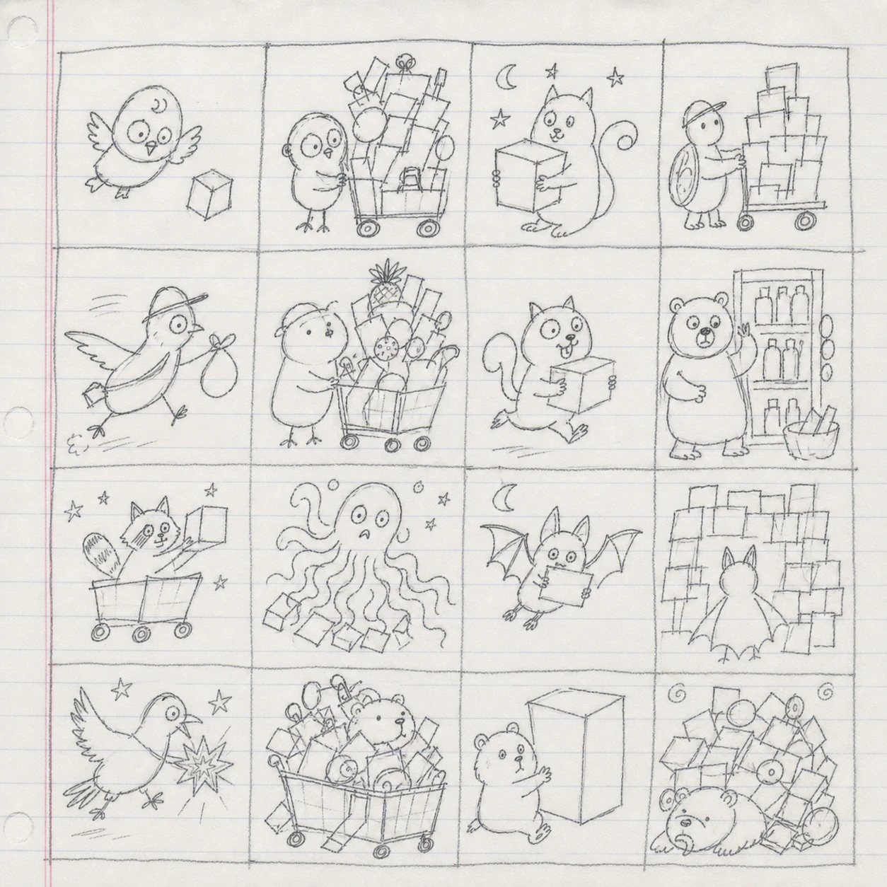

# coupangctl

내 쿠팡 주문을 내 컴퓨터에 동기화하고, CLI와 AI로 검색·분석하는 로컬 우선 오픈소스 도구입니다.


[](https://github.com/JungHoonGhae/coupang-ctl/actions/workflows/ci.yml)
[](LICENSE)


> [!IMPORTANT]
> `coupangctl`은 쿠팡의 공식 제품이 아닙니다. 내 계정의 데이터를 내가 요청한 범위에서 읽고 정리하며, 주문 확정과 결제는 지원하지 않습니다.

<p align="center">
  
</p>
<p align="center"><sub>구매 리듬과 장바구니 행동을 설명하는 16가지 쇼핑 유형 · 공개 가능한 합성 시각 예시</sub></p>

## 한눈에 보기

- **내 주문 기록** — 전체 주문을 중단 후 이어받을 수 있게 동기화하고 SQLite에 정규화합니다.
- **내 소비 분석** — 월별 지출, 취소·반품, 구매 시간대, 배송 소요, 반복 구매, 카테고리를 계산합니다.
- **공유용 리캡** — 근거와 표본을 함께 보여주는 독립형 HTML 리캡과 16가지 쇼핑 유형을 만듭니다.
- **자연어 상품 탐색** — AI가 자연어 조건을 타입이 있는 검색·상세 조회로 바꿉니다.
- **CLI와 MCP** — 같은 typed core를 터미널과 MCP 클라이언트에서 함께 사용합니다.
- **구매 직전까지만** — 장바구니 추가는 명시적으로 확인한 한 상품만 가능하고, 주문·결제는 경계 밖입니다.

## 쿠팡 파트너스 고지

[쿠팡 홈 열기](https://link.coupang.com/a/gIEGRL0z7c)

이 링크를 통해 구매하면 쿠팡 파트너스 활동의 일환으로 일정액의 수수료를
제공받습니다. 제휴 링크 자체로 구매자에게 별도 수수료가 부과되지는 않으며,
상품 가격과 혜택은 쿠팡의 최종 화면에서 확인해야 합니다. 프로젝트 운영자의
본인 구매는 수익 인정 대상이 아닙니다.

## 3분 빠른 시작

현재는 소스 빌드를 기준으로 합니다. Go 1.26 이상과 설치된 Chrome 계열 브라우저가 필요합니다.

```bash
git clone https://github.com/JungHoonGhae/coupang-ctl.git
cd coupang-ctl
go build -o ./bin/coupangctl ./cmd/coupangctl

./bin/coupangctl doctor
./bin/coupangctl auth login
./bin/coupangctl sync
./bin/coupangctl recap --output ./shopping-recap.html
```

`auth login`은 QR 로그인을 기본으로 엽니다. 휴대폰에서 승인하면 로그인 상태는
전용 브라우저 프로필 안에 남고, 이후 읽기는 화면 없는 headless 모드로 먼저
실행합니다. 접근이 거부되고 데스크톱을 쓸 수 있을 때만 같은 전용 프로필의 창을
한 번 열어 재시도합니다. 확장 프로그램, Node, Playwright, Orca는 기본 실행에
필요하지 않습니다. 모든 CLI 명령은 문서화된 JSON 객체를 출력합니다.

`doctor`는 보이는 창을 열지 않고 브라우저 설치, 백그라운드 세션 준비 상태,
SQLite를 별도 체크로 반환합니다. 첫 로그인 전이나 headless 접근이 거부된
환경에서는 설치가 정상이어도 전체 `ok`가 `false`일 수 있으며,
`background_session.message`가 다음 동작을 설명합니다.

여섯 플랫폼 아카이브·SBOM·체크섬·GitHub provenance를 만드는 태그 릴리스
파이프라인은 snapshot으로 검증되어 있지만, 아직 공개 릴리스 태그가 없으므로
존재하지 않는 다운로드 URL을 설치 경로로 안내하지 않습니다. 배포물의 정확한
파일 허용 목록과 검증 방법은 [`RELEASING.md`](RELEASING.md)에 있습니다.

> [!CAUTION]
> 생성된 세션과 주문 DB는 개인 데이터입니다. 공유용 리캡은 기본적으로 상품명과 정확한 날짜를 제외하지만, `--include-products`로 만든 HTML은 파일 자체에 실제 상품·금액·날짜가 들어 있으므로 공유하면 안 됩니다.

## 무엇을 할 수 있나요?

| 영역 | 상태 | 할 수 있는 일 |
| --- | --- | --- |
| 로그인·세션 | 사용 가능 | QR, 일회성 앱 링크, 사용자 OTP 기반 SMS 로그인과 세션 검증 |
| 현재 Chrome 연결 | 실험적 | Chrome의 명시적 승인 뒤 확장 없이 실행 중인 브라우저로 주문 동기화 |
| 선택 탭 확장 연결 | 실험적 | 현재 Chrome 연결을 쓸 수 없을 때의 선택적 최소 권한 호환 경로 |
| 주문 기록 | 사용 가능 | 전체 이력 동기화, 이어받기, 목록·내보내기·가져오기 |
| 소비 분석 | 사용 가능 | 지출, 멤버십 비용 분리, 취소·반품, 시간대, 배송 추세 |
| 쇼핑 유형·리캡 | 사용 가능 | 근거가 보이는 4축 유형, 배지, 공개형·비공개형 HTML |
| 상품별 인사이트 | 사용 가능 | 구매 횟수·수량·기록된 결제액·최고/최저 지출일 |
| 상품 검색·상세 | 사용 가능 | 가격, 배송, 이미지, 혜택, 평점, 정제된 후기, 정렬 의미 보존 |
| 가격 이력·재구매 | 실험적 | 실제로 관찰한 옵션별 현재가와 마지막 실결제 단가 비교 |
| WOW·카드 혜택 | 실험적 | 현재 멤버십, 쿠팡이 표시한 혜택, 등록 카드 브랜드, 월별 적립 |
| 카테고리 | 실험적 | 실제 breadcrumb 경로, 집계 커버리지, 재관측 안정성 |
| 장바구니 | 실험적 | 정확한 `vendor_item_id`와 명시적 확인이 있을 때 한 번 추가 |
| 영수증 일괄 처리 | 실험적 | 현금·카드 상태·이력·기간 합계, 주문별 거래명세, 완료 파일의 비공개 저장 |
| 주문·결제 | 지원 안 함 | 자동 주문, 결제, 구매 확정은 구현하지 않음 |

현재 구현 상태와 다음 순서는 [`ROADMAP.md`](ROADMAP.md)와 `coupangctl capabilities`에서 확인할 수 있습니다. capabilities schema v2는 각 항목의 `implemented`, `next_step_kind`, `blocked_by`, `last_verified`를 분리하므로 AI도 “더 구현할 일”과 “외부 승인·사용자 확인·시간 경과가 필요한 검증”을 구별할 수 있습니다. 일반 Chrome 브리지의 설치·권한·제거 계약은 [`BROWSER_BRIDGE.md`](BROWSER_BRIDGE.md)에 있습니다.

모든 주문 동기화 결과는 schema v1의 `source`와 `provenance`를 함께 반환합니다.
`source`는 `dedicated_browser_profile`, `current_browser_connection`,
`ordinary_browser_selected_tab` 중 실제 선택된 수집 adapter이고,
`provenance`는 쿠팡 주문 화면의 구조화 문서에서 관찰했다는 뜻의
`observed_source_native_structured_order_document`입니다. 호출자가 이 값을
입력해서 수집 출처를 가장할 수는 없습니다.

## 주문 분석과 리캡

```bash
coupangctl orders list --limit 20
coupangctl orders spend --from 2026-01-01
coupangctl orders stats --from 2026-01-01
coupangctl orders insights
coupangctl orders products
coupangctl orders categories --max-products 25
coupangctl orders categories --max-products 25 --recheck
coupangctl orders category-catalog --query '생활용품'
coupangctl orders category-stability
coupangctl orders reorder --limit 20
coupangctl orders recap --output ./shopping-recap.html
coupangctl orders recap-image
coupangctl orders recap-image --output ./shopping-recap.png --confirm-public-safe-image
```

분석값은 세 가지 출처를 구분합니다.

- **관찰값**: 쿠팡 화면이나 구조화 응답에서 직접 읽은 값
- **계산값**: 관찰값을 명시적인 규칙으로 합산·분류한 값
- **추론값**: 원천에 없는 정보를 휴리스틱으로 추정한 값

공개형 리캡은 기간, 표본 수, 분모, 제외 규칙을 함께 보여줍니다. 카테고리는 상품명으로 억지 매핑하지 않고 쿠팡 상품 페이지의 가변 길이 `BreadcrumbList`만 사용하며, 확인하지 못한 상품은 `unknown`으로 남깁니다.

`orders recap-image`는 먼저 1080×1350 공유 카드에 들어갈 실제 값과
provenance, 표본 수, 제외 필드를 JSON으로 미리 보여주며 파일을 만들지
않습니다. 그 내용을 확인한 뒤 `--output`과
`--confirm-public-safe-image`를 함께 줄 때만 새 `0600` PNG를 씁니다.
PNG에는 상품명·금액·정확한 날짜·결제수단을 넣는 옵션 자체가 없습니다.
응답 계약은 [`RECAP.md`](RECAP.md)에 있습니다.

`orders category-catalog`은 그 breadcrumb에서 실제로 관찰한 카테고리
이름·숫자 ID·경로만 찾습니다. 응답의 `category_id`를
`products search --category-id ID`에 넘기면 사람이 ID를 외우거나 AI가 분류 체계를 추측할
필요가 없습니다. `observed_product_count`는 내 주문 원장에서 해당 경로가
관찰된 distinct 상품 수이며 쿠팡 판매량이나 인기도가 아닙니다. 분류 성공률과
미분류 상품 수도 항상 함께 반환합니다. 자세한 계약은
[`CATEGORIES.md`](CATEGORIES.md)에 있습니다.

`orders categories --recheck`는 요청할 때만 이미 캐시된 상품을 가장 오래
확인한 순서로 제한적으로 다시 읽어 append-only 관측을 남깁니다.
`orders category-stability`는 동일 `vendor_item_id`의 경로가 재관측 사이에
달라졌는지, 같은 상품을 서로 다른 날짜에 확인했는지, 표본과 커버리지가
충분한지를 구조화해 보여줍니다. 한 로컬 원장의 결과를 쿠팡 전체나 다른
계정의 안정성으로 확대 해석하지 않습니다.

`orders spend`는 전체 원장 합계와 함께 `product_purchases`, `membership_fees`, `unclassified`를 분리합니다. 명시적인 멤버십 결제를 상품 구매나 연속 구매 기록에 섞지 않습니다.

## WOW 멤버십 비용과 혜택

```bash
coupangctl orders sync
coupangctl account benefits
```

`membership_costs`는 상품명이나 결제액으로 추정하지 않고, 쿠팡 원천
metadata에서 멤버십으로 명시된 주문만 합산합니다. 결제 횟수·gross·취소 제외
금액·최초/최근 결제일과 함께 전체 주문 동기화가 끝났는지도 표시합니다.

쿠팡 화면이 혜택 총액을 `최근 3개월`로 표시하는 경우 그 기간도 관찰값으로
반환합니다. 실제 과거 회비가 없으면 현재 월회비×3을 비교용 비용으로만 사용해
`estimated_net_value_krw`를 계산합니다. 이 값은 `inferred`이며
`confirmed_net_value_krw`는 0으로 남습니다. 멤버십 중지·환불·무료기간·기간 중
요금 변경은 이 추정에 반영되지 않습니다. 화면에 원천 요금 변경일이 있으면 별도
관찰 metadata로 반환하지만, 이를 과거 청구 이력으로 해석하지 않습니다.
와우카드 적립과 공개된 카드 연회비도 기간 중복을 증명할 수 없어 멤버십 비교에서
분리합니다. 응답 계약은
[`ACCOUNT.md`](ACCOUNT.md)에 있습니다.

## 자연어로 상품 찾기

CLI는 관찰 가능한 조건을 그대로 받습니다.

```bash
coupangctl products search \
  --query '후기 좋은 10만원 아래 맥북 허브' \
  --max-price 100000 \
  --min-rating 4.5 \
  --exclude-sponsored

coupangctl products search \
  --query '게이밍 데스크탑 16GB 512GB' \
  --min-memory-gb 16 \
  --min-storage-gb 512 \
  --exclude-used \
  --sort sales
```

MCP를 쓰면 AI가 “후기 좋은 10만 원 아래 맥북 허브, 광고 제외” 같은 요청을 `products_search`의 typed filter로 바꿉니다. 실제 카테고리 이름으로 찾고 싶으면 먼저 `orders_category_catalog`에서 관찰된 ID를 고른 뒤 `products_search.category_id`로 넘깁니다. 선택한 후보는 `product_inspect`로 가격, 배송, 이미지, 상세 내용, 관찰된 쿠폰·카드 혜택, 평점과 정제된 후기를 확인할 수 있습니다.

정렬 의미는 섞지 않습니다.

- `coupang_ranking`: 쿠팡 랭킹순
- `sales`: 판매량순
- `latest`: 최신순
- `price_asc`, `price_desc`: 가격순
- 평점·후기 수: 현재 관찰한 카드 집합의 로컬 정렬

상품 페이지 단위 후기 수를 옵션별 판매량처럼 표현하지 않습니다. 상품 가격과 프로모션은 바뀔 수 있으므로 최종 쿠팡 화면에서 다시 확인해야 합니다.

### 가격 이력과 재구매 비교

성공한 `products search`와 `products inspect`는 응답에 실제
`price.current_amount`가 있을 때만 해당 옵션의 현재가를 로컬 SQLite에
기록합니다. 이후 다음처럼 읽습니다.

```bash
coupangctl products price-history --product-id ID --vendor-item-id ID
coupangctl orders reorder --limit 20
coupangctl products watch-add --product-id ID --vendor-item-id ID
coupangctl products watch-refresh --limit 20 --stale-hours 24
coupangctl products watch-schedule --format auto --at 03:00
```

가격 이력은 coupangctl이 처음 본 시점부터 시작합니다. 쿠팡의 과거 가격을
소급해서 안다고 주장하지 않으며, `vendor_item_id`가 다른 옵션은 별도
series로 유지합니다. `orders reorder`는 동일 ID의 최신 관찰가와 취소·반품
없는 마지막 결제 단가가 모두 있을 때만 차이를 계산합니다. 명령 자체는
새 가격을 조회하지 않으므로 `observed_at`을 보고 최종 상품 화면에서 다시
확인해야 합니다.

watchlist에는 이미 가격을 관찰한 정확한 ID만 등록할 수 있습니다.
`watch-refresh`는 마지막 확인이 기준 시간보다 오래된 항목만 순서대로 상세
조회하므로 cron, systemd timer, CI 같은 운영체제 스케줄러에서 그대로
반복 실행할 수 있습니다. 제휴 링크 변환이나 장바구니·주문·결제는 호출하지
않습니다.

`watch-schedule`은 현재 운영체제에서 macOS `launchd`, Linux `systemd`,
Windows Task Scheduler, 그 밖의 환경은 cron 계획을 생성합니다. 계획만 JSON으로
검토할 수도 있고, 다음처럼 새 설정 파일을 `0600`으로 쓸 수도 있습니다.

```bash
coupangctl products watch-schedule \
  --format systemd \
  --at 03:00 \
  --output-dir ./coupangctl-scheduler
```

기존 파일은 덮어쓰지 않으며, systemd/launchd/crontab/Task Scheduler 활성화는
출력된 `activation` 안내를 검토한 뒤 사용자가 실행합니다. 생성 작업은 기본
headless `watch-refresh`만 호출하며 접근이 거부되어도 창을 열지 않으므로
서버에서도 쓸 수 있습니다. 보호된 세션이 만료되면 headed 재로그인은 별도로
필요합니다.

로컬 가격 관찰만 지우려면 명시적인 확인 문자열이 필요합니다.

```bash
coupangctl products price-history-purge --confirm purge-product-price-history
coupangctl products watch-clear --confirm clear-product-watchlist
```

응답 계약과 계산 규칙은 [`PRICES.md`](PRICES.md)에 정리되어 있습니다.

### 장바구니 추가

```bash
coupangctl products cart-add \
  --product-id ID \
  --vendor-item-id ID \
  --quantity 1 \
  --confirm-add-to-cart
```

검색에서 관찰한 정확한 `vendor_item_id`와 `--confirm-add-to-cart`가 모두 필요합니다. 결과를 검증하지 못하면 자동 재시도하지 않으며, 구매·주문·결제 버튼으로 이동하지 않습니다.

## 영수증과 결제수단 합계

이미 존재하는 현금·카드 영수증 요청의 상태와 이력, 기간 합계를 읽을 수 있습니다.

```bash
coupangctl receipts status
coupangctl receipts list --kind card --page 0 --size 5
coupangctl receipts summary --kind card --from 2026-01-01 --to 2026-08-31
coupangctl receipts overview --from 2021-01-01 --to 2026-08-31
coupangctl receipts vendor --source-ref HASH --headed
coupangctl receipts download --kind card --history-index 0 --output ./receipt.pdf
```

`summary`의 전체 건수·금액은 영수증 화면의 관찰값이고, 결제수단 행은 관찰된 카드별 합계를 안전한 표시명으로 묶은 계산값입니다. `overview`는 최대 20년을 비중첩 달력연도 구간으로 나눠 현금·카드를 각각 합산하고 결제수단 순위를 제공합니다. 두 영수증 원천을 임의로 더해 총지출이라고 부르지는 않습니다. `vendor`는 `orders list`가 반환한 SHA-256 `source_ref`로 한 주문을 찾고, 판매자별 결제수단·상품·취소 결제 구성요소를 `private_local`로 읽습니다. 원주문 ID는 브라우저 adapter 밖으로 나오지 않습니다. 취소 구성 필드는 관찰된 원본 의미를 보존하며 확정 환불액으로 합산하지 않습니다. 카드 식별자와 카드번호는 typed response 전에 버리고, 할부 개월 필드가 확인되지 않은 동안 할부 통계는 `unavailable`로 둡니다. `download`는 이미 완료된 이력의 파일만 새 `0600` 파일로 저장하며 기존 파일을 덮어쓰지 않습니다. 다운로드 URL은 출력하거나 로그에 남기지 않습니다.

영수증 생성 요청은 외부 상태를 바꾸는 POST 작업이므로 구현하지 않았습니다. 현재 응답 계약은 [`RECEIPTS.md`](RECEIPTS.md)에 정리되어 있습니다.

## MCP 연결

표준 stdio MCP 설정은 다음과 같습니다. `command`에는 빌드한 바이너리의 절대경로를 권장합니다.

```json
{
  "mcpServers": {
    "coupangctl": {
      "command": "/absolute/path/to/coupangctl",
      "args": ["mcp"]
    }
  }
}
```

MCP 서버는 장시간 백그라운드에서 실행되는 프로세스이므로 기본 브라우저 읽기가
거부되어도 보이는 창을 임의로 열지 않습니다. 사용자가 화면을 보고 재시도하려면
해당 CLI 명령의 `--headed`를 명시하거나, Chrome에서 직접 승인한
`orders_sync_current_browser`를 사용합니다.

대표 도구:

- `auth_status`, `current_browser_status`, `account_benefits`
- `orders_sync`, `orders_sync_current_browser`, `orders_sync_ordinary_browser`, `orders_list`, `orders_spend`, `orders_stats`
- `orders_insights`, `orders_product_insights`, `orders_category_catalog`, `orders_category_stability`, `orders_reorder_candidates`
- `orders_export`, `orders_enrich_categories`
- `products_search`, `product_inspect`, `cart_add`
- `product_price_history`
- `product_watchlist`, `product_watch_add`, `product_watch_remove`, `product_watch_refresh`
- `receipts_status`, `receipts_list`, `receipts_summary`, `receipts_overview`, `receipts_vendor`

읽기 도구와 변경 도구는 MCP annotation과 입력 타입에서 구분됩니다. 상품 검색·상세는 관찰가를 로컬 이력에 추가할 수 있고, watch 도구는 로컬 watchlist만 바꿉니다. 영수증 MCP 도구는 조회 전용이고 파일 다운로드는 CLI에만 있습니다. `cart_add`만 되돌릴 수 있는 외부 변경이며 별도 확인값을 요구합니다.

## 로그인 방식

| 방식 | 명령 | 용도 |
| --- | --- | --- |
| QR | `coupangctl auth login` | 기본값. 실제 브라우저에서 QR을 열고 휴대폰으로 승인 |
| 앱 링크 | `coupangctl auth login --link` | QR에서 읽은 일회성 링크와 두 자리 승인번호를 stderr에 한 번 표시 |
| SMS | `coupangctl auth login --phone` | 번호 요청과 전달받은 OTP만 UI에 입력하며 CAPTCHA는 사용자가 푸는 대안 |
| 원격 화면 | `coupangctl auth login --qr-output /secure/path/qr.png` | Xvfb 같은 headed renderer에서 QR 부분만 임시 PNG로 전달 |

로그인은 headed 브라우저에서만 진행합니다. 실측상 보호된 로그인 진입점은 진짜
headless Chrome을 거부할 수 있습니다. `auth status`와 기본 `auth verify`는 상태
확인만으로 창이 갑자기 열리지 않도록 headless에서만 검사합니다. 실제 데이터
읽기는 headless 우선이며, 환경이 거부할 때만 설치된 브라우저의 headed 읽기로 한
번 재시도할 수 있습니다. 눈에 보이는 검증이 필요할 때는 사용자가 명시적으로
`auth verify --headed`를 실행합니다. 조용한 검사가 거부되면 `auth status`는 이를
로그아웃으로 추측하지 않고 구조화된 `access_blocked` 상태로 반환합니다. 로그인
상태는 브라우저 소유 전용 프로필에만 남으며 별도 쿠키·세션 파일로 복사하지
않습니다.

Chrome 144 이상에서는 실행 중인 현재 Chrome을 확장 없이 사용하는 실험적 고급
경로도 있습니다. 먼저 `chrome://inspect/#remote-debugging`에서 원격 디버깅을
직접 켭니다. 연결이나 탭 생성 없이 로컬 endpoint 준비 상태만 먼저 확인할 수
있습니다.

```bash
coupangctl current-browser status
coupangctl sync --max-pages 1 --current-browser
```

`current-browser status`는 `not_enabled` 또는 `endpoint_available`만 반환하며 로컬
포트, debugger token, 프로필 경로를 출력하지 않습니다. 또한 Chrome 승인 팝업을
띄우지 않으므로 `connection_approval_verified`는 항상 `false`입니다. 실제 sync를
시작한 뒤 Chrome의 연결 요청을 승인해야 합니다.

MCP에서는 `orders_sync_current_browser`를 사용합니다. 이 모드는
`coupangctl`이 만든 탭만 열고 닫으며 Chrome 자체는 종료하지 않고, 쿠키나 세션
상태를 복사하지 않습니다. 다만 Chrome의 디버깅 승인은 해당 프로필의 열린 탭,
쿠키, 저장소까지 접근할 수 있는 넓은 권한입니다. 따라서 자동으로 켜거나 무인
서버용으로 취급하지 않으며 기본 모드로도 사용하지 않습니다.

전용 브라우저와 승인된 현재 Chrome을 모두 쓰기 어려운 경우에만 선택 탭 확장
브리지를 호환 경로로 사용할 수 있습니다.

```bash
coupangctl browser-bridge install
coupangctl browser-bridge doctor
coupangctl orders sync --max-pages 1 --ordinary-browser
```

`install`은 실행 중인 바이너리의 절대경로로 사용자 범위 Native Messaging 호스트를 등록하고 검토된 확장 번들을 응답의 `extension_path`에 풉니다. 이 개발자용 압축해제 설치는 일반 사용자의 빠른 시작이 아닙니다. Web Store 배포 전 검증에서만 그 경로를 `chrome://extensions`에 한 번 로드합니다. `doctor`의 `ready`가 `true`인지 확인한 뒤 동기화 명령을 먼저 실행하고, 이미 로그인된 일반 Chrome의 쿠팡 주문목록 탭에서 확장 팝업을 엽니다. 읽을 필드와 로컬 전송 범위를 확인하고 **이 탭 연결**을 눌러야 읽기가 시작됩니다. 확장은 그 탭에만 임시 접근하며 쿠키를 읽거나 복사하지 않습니다. Chrome은 정확히 허용된 로컬 네이티브 호스트와 통신하고, 호스트는 2분짜리 단일 사용 인증으로 대기 중인 CLI에 연결합니다. MCP에서는 같은 흐름을 `orders_sync_ordinary_browser`로 호출합니다.

`browser-bridge uninstall`은 동일 설치가 기록한 번들·매니페스트·등록이 모두 일치할 때만 해당 파일을 제거하며 Chrome 프로필, 쿠키, 확장 데이터, 주문 DB는 건드리지 않습니다. 서버처럼 일반 Chrome을 직접 사용할 수 없는 환경은 `orders export`/`orders import`로 정규화 데이터를 옮깁니다. 자세한 JSON 계약은 [`BROWSER_BRIDGE.md`](BROWSER_BRIDGE.md)에 있습니다.

`--link` 출력은 짧게 살아 있는 인증 정보이므로 로그로 리디렉션하지 마세요. OTP, 쿠키, QR 링크는 JSON·세션 파일·테스트 fixture·오류 메시지에 넣지 않습니다.

## 데이터 저장과 개인정보

상태 경로:

- macOS: `~/Library/Application Support/coupangctl`
- Linux: `$XDG_STATE_HOME/coupangctl` 또는 `~/.local/state/coupangctl`
- Windows: `%LOCALAPPDATA%\\coupangctl`

테스트 격리는 `COUPANGCTL_STATE_DIR`에 절대경로를 지정합니다. 브라우저 자동 탐색이 실패할 때만 `COUPANGCTL_BROWSER_PATH`를 사용합니다.

| 데이터 | 처리 원칙 |
| --- | --- |
| 쿠키·세션 | 전용 Chrome 프로필 안에만 유지하고 별도 파일로 복사·출력하지 않음 |
| OTP·비밀번호·QR 링크 | 저장·로그·구조화 출력 금지 |
| 카드·영수증 | 카드 식별자·번호·다운로드 URL은 버리고, 다운로드 파일은 새 `0600` 경로에만 저장 |
| 가격 관찰 | 공개 상품명·옵션 ID·관찰가·시각을 로컬 DB에만 저장하고 별도 확인 명령으로 삭제 |
| 주문 원본 응답 | 저장·fixture·문서 포함 금지 |
| 정규화 주문 DB | 내 컴퓨터에 저장, 내보내기는 명시적 명령으로만 수행 |
| 공개형 리캡 | 상품명과 정확한 날짜를 제외한 `public_safe` |
| 상품 포함 리캡 | 실제 상품·금액·날짜가 있는 `private_products` |
| 후기 | 리뷰어 식별자는 버리고 전화번호·이메일 패턴을 가림 |

역공학한 읽기 엔드포인트는 불안정할 수 있습니다. 응답 형식은 좁은 adapter 뒤에 두고, 실패를 우회 성공으로 표현하지 않습니다. 테스트와 문서는 합성 fixture와 가린 네트워크 메타데이터만 사용합니다.

## 구조

```text
cmd/coupangctl
  ├─ CLI adapter ─────┐
  │                   ├─ typed services ─┬─ installed browser adapters
  └─ MCP stdio adapter┘                  ├─ approved current-Chrome adapter
                                        ├─ optional selected-tab extension bridge
                                        └─ SQLite repository
```

typed core, CLI adapter, MCP adapter를 분리합니다. CLI와 MCP가 각자 브라우저 로직을 갖지 않으며, 운영 코드에는 Playwright·Orca·특정 에이전트 런타임 의존성이 없습니다. 비공개·역공학 응답은 좁은 adapter에 격리하므로, 나중에 공식 API가 생겨도 core와 두 인터페이스를 유지할 수 있습니다.

TypeScript 코드는 프로토콜 조사용 probe에만 남아 있고 배포 바이너리의 런타임 의존성이 아닙니다.

## 개발

```bash
go test ./...
go vet ./...
npm run typecheck
go build ./cmd/coupangctl
```

새 지표는 typed response, provenance, 분모, 표본 수, 누락 동작, 합성 테스트, 리캡 문구가 모두 맞을 때만 완료로 봅니다. 자세한 원칙은 [`PRODUCT_PRINCIPLES.md`](PRODUCT_PRINCIPLES.md)를 참고하세요.

## 파트너스 링크 비활성화

공식 쿠팡 파트너스 API 키가 설정되면 원본 쿠팡 URL과 별도로 `affiliate_url`을 반환할 수 있습니다. 사용자에게 제휴 링크를 강제하지 않습니다.

```bash
export COUPANGCTL_AFFILIATE_DISABLED=true
coupangctl products inspect --product-id ID --no-affiliate
```

개발용 키는 Doppler의 `cli-mcp-lab/dev_coupang` 설정에서만 관리합니다. 저장소에는 `COUPANG_PARTNERS_ACCESS_KEY`, `COUPANG_PARTNERS_SECRET_KEY`, 선택적인 `COUPANG_PARTNERS_SUB_ID`라는 이름만 문서화하며 값은 넣지 않습니다.

## 문서

- [`ROADMAP.md`](ROADMAP.md) — 기능 우선순위와 구현 상태
- [`HANDOFF.md`](HANDOFF.md) — 검증된 동작과 아키텍처 결정
- [`TYPE_SYSTEM.md`](TYPE_SYSTEM.md) — 네 가지 행동 축과 16개 유형
- [`RECEIPTS.md`](RECEIPTS.md) — 영수증 조회·다운로드의 JSON 계약과 안전 경계
- [`PRICES.md`](PRICES.md) — 옵션별 가격 이력과 재구매 비교 계약
- [`PRODUCT_PRINCIPLES.md`](PRODUCT_PRINCIPLES.md) — 증거·개인정보·완료 기준
- [`BROWSER_BRIDGE.md`](BROWSER_BRIDGE.md) — 일반 Chrome 설치·진단·제거와 MCP 계약
- [`PRIVACY.md`](PRIVACY.md) — 로컬 데이터 흐름·보관·삭제와 확장 권한 설명
- [`extension/README.md`](extension/README.md) — 일반 Chrome 연결의 개발자용 등록·검증 방법
- [`extension/STORE_LISTING.md`](extension/STORE_LISTING.md) — Chrome Web Store 제출 문구와 검증 게이트
- [`research/ordinary-browser-bridge.md`](research/ordinary-browser-bridge.md) — 일반 Chrome 보호 데이터 브리지의 공식 자료 기반 설계·위협 모델
- [`research/browser-distribution-alternatives.md`](research/browser-distribution-alternatives.md) — 최신 Chrome·WebDriver·주요 오픈소스의 배포 방식 비교와 기본 구조 결정
- [`research/endpoint-catalog.md`](research/endpoint-catalog.md) — 가린 비공개 route 목록
- [`research/README_BENCHMARKS.md`](research/README_BENCHMARKS.md) — 인기 CLI·MCP 저장소를 참고한 README 설계 근거

## 기여

[이슈](https://github.com/JungHoonGhae/coupang-ctl/issues)와 Pull Request를 환영합니다. 버그를 재현할 때는 실제 주문 응답, 쿠키, OTP, 전화번호, 계정 식별자를 첨부하지 말고 합성 데이터나 가린 메타데이터를 사용해 주세요. PR을 보내기 전에는 위의 개발 명령 네 가지를 모두 통과시켜 주세요.

## 라이선스

[MIT](LICENSE)

`coupangctl`은 쿠팡의 공식 제품이 아니며, 쿠팡 및 관련 상표는 각 권리자에게 귀속됩니다.
