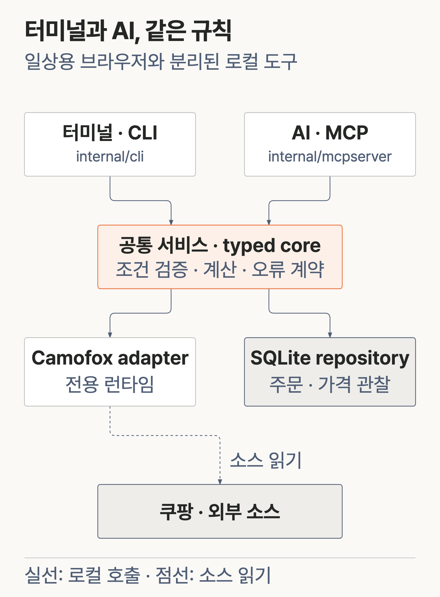
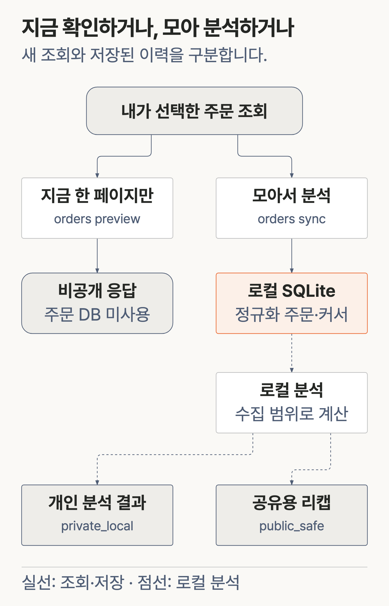
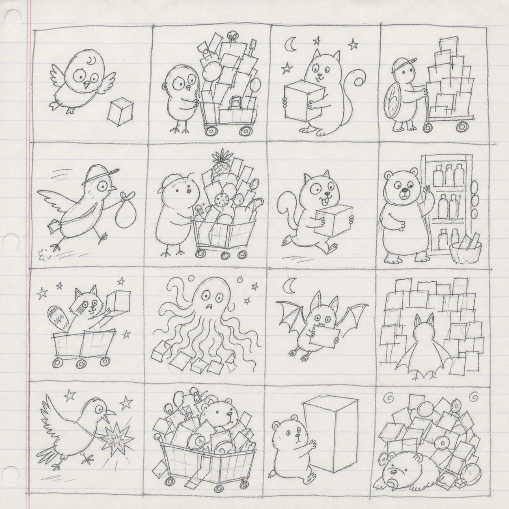
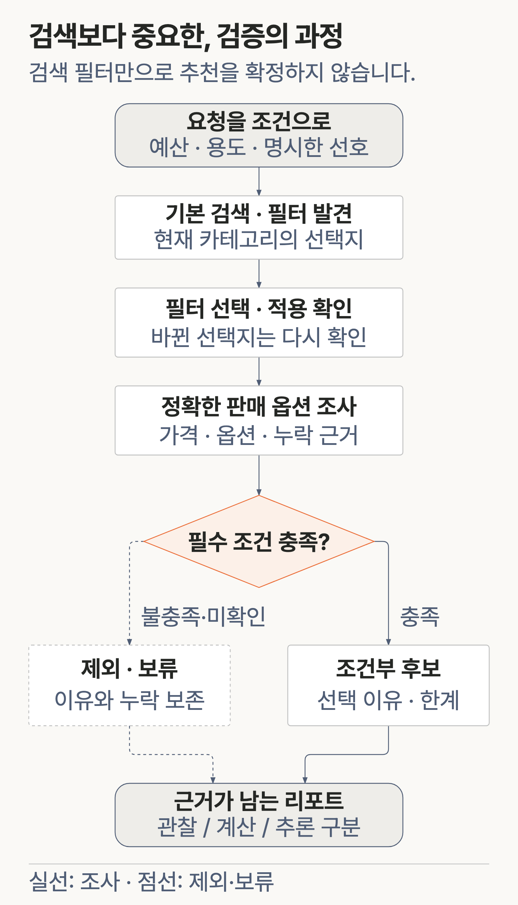

# coupangctl

내 쿠팡 주문을 내 컴퓨터에 동기화하고, CLI와 AI로 검색·분석하는 로컬 우선 오픈소스 도구입니다.


[](https://github.com/JungHoonGhae/coupang-ctl/actions/workflows/ci.yml)
[](LICENSE)


> [!IMPORTANT]
> `coupangctl`은 쿠팡의 공식 제품이 아닙니다. 내 계정의 데이터를 내가 요청한 범위에서 읽고 정리하며, 주문 확정과 결제는 지원하지 않습니다.

[시작하기](#개발-소스-빠른-시작) · [주문 확인](#무엇을-할-수-있나요) · [상품 추천](#추천-조사-실험적) · [MCP 연결](#mcp-연결) · [개발](#개발)

## 한눈에 보기

- **현재 주문 확인** — 첫 페이지만 읽는 `preview`는 주문 DB를 열거나 저장하지 않습니다.
- **주문 수집과 분석** — `sync`로 정규화해 저장한 범위에서 지출·취소·반품·반복 구매를 계산합니다.
- **상품 탐색과 추천** — 현재 검색 필터를 발견하고 판매 옵션을 조사해 선택 이유와 미확인 근거를 남깁니다.
- **개인 보고서와 공유용 리캡** — 상품·구매 맥락이 있는 비공개 결과와 공개 가능한 요약을 구분합니다.
- **CLI와 MCP** — 같은 typed core를 사용합니다. 현재 장바구니 변경은 미지원이며 주문·결제는 자동화하지 않습니다.

<p align="center">
  
</p>

위 그림은 호출 방향입니다. 로컬 통계·동기화 상태 확인·HTML 보고서 렌더링은 브라우저를 시작하지 않습니다.
소스 조회에 쓰는 전용 Camofox도 일상용 Chrome·Aside와 분리합니다.
[구현 위치](#구조) · [다이어그램 원본과 재생성](docs/diagrams/README.md)

## 쿠팡 파트너스 고지

[쿠팡 홈 열기](https://link.coupang.com/a/gIEGRL0z7c)

이 링크를 통해 구매하면 쿠팡 파트너스 활동의 일환으로 일정액의 수수료를
제공받습니다. 제휴 링크 자체로 구매자에게 별도 수수료가 부과되지는 않으며,
상품 가격과 혜택은 쿠팡의 최종 화면에서 확인해야 합니다. 프로젝트 운영자의
본인 구매는 수익 인정 대상이 아닙니다.

## 개발 소스 빠른 시작

현재 개발 소스는 전용 Camofox를 유일한 쇼핑 브라우저로 사용합니다. 이전
Chrome 기반 릴리스와 요구 의존성이 다릅니다. Go 빌드에는 Go 1.26 이상,
실행에는 Node 22 이상과 검증해 설치한 Camofox 서버·Camoufox 엔진이 필요합니다.
이 교체는 아직 새 릴리스로 배포하거나 릴리스 산출물로 검증한 상태가 아닙니다.

```bash
go build -o ./coupangctl ./cmd/coupangctl
./coupangctl camofox setup --runtime /absolute/path/to/camofox --engine-dir /absolute/path/to/camoufox
./coupangctl doctor
./coupangctl login --manual
./coupangctl products search --query '미니 식기' --limit 3 --no-affiliate
./coupangctl orders preview
./coupangctl orders sync --max-pages 1
./coupangctl orders sync-status
./coupangctl orders stats
```

조회는 headless로 실행하며 설치된 Aside, Chrome, 확장, Swift 도구나 Orca를
사용하지 않습니다. 직접 인증을 선택했을 때만 전용 창을 엽니다.
`doctor`는 로컬 설치 파일만 확인하며 로그인 완료를 보증하지 않습니다.
실제 세션 확인에는 `auth status` 또는 `auth verify`를 사용합니다.
확인은 사이트의 인증 상태만 읽으며 주문 목록을 파싱하지 않습니다. 성공 응답의
`verification_scope: authenticated_session`은 로그인 확인만 뜻합니다. 계정 식별,
주문 조회 가능 여부, 전체 이력 확보는 각각 별도로 검증합니다. 인증 응답이
누락되거나 잘못됐으면 `authentication_status_unavailable`이며 재로그인을 자동으로
시작하지 않습니다. 접근 차단도 세션 만료로 간주하지 않습니다.
설정이 없거나 소스 읽기가 실패해도 다른 브라우저로 대체하지 않습니다.

> 생성된 세션과 주문 DB는 개인 데이터입니다. 실제 상품·금액·날짜를 포함한
> `--include-products` 보고서는 공유하지 마세요. 다운로드한 릴리스를 사용할 때는
> [RELEASING.md](RELEASING.md)의 체크섬·SBOM·attestation 검증을 별도로 수행하세요.

## 무엇을 할 수 있나요?

지금 주문만 확인하려면 `orders preview`, 이력을 모아 분석하려면 `orders sync`부터 시작하세요.

<p align="center">
  
</p>

로그인 확인, 현재 계정과 DB의 연결, 전체 이력 확보는 별도 검증입니다.
수집이 끝났다는 표시만으로 세 가지가 모두 확인된 것은 아닙니다.

### 저장하지 않고 현재 주문 확인

`coupangctl orders preview` 또는 MCP `orders_preview`로 현재 로그인 세션의
주문 첫 페이지를 확인합니다. 전용 Camofox로 한 페이지만 읽으며 주문 DB를
열거나 저장하지 않습니다. 기존 체크포인트부터 이어 읽지도 않습니다.
이 명령에는 페이지 수나 기간 옵션이 없습니다.

응답은 `private_local`이며 정규화한 주문·상품 자료와 조회 시각 `captured_at`,
건수 `order_count`, 다음 페이지 유무 `has_next_page`를 반환합니다.
`scope: source_entry_page`는 원천의 첫 응답 범위만 뜻합니다. 빈 페이지도
“구매한 적 없음”으로 해석하지 않습니다.

`persisted`, `account_identity_verified`, `history_complete`는 모두 `false`입니다.
현재 로그인 계정과 기존 DB의 연결, 전체 구매 이력, 구매 패턴을 검증한 결과가
아닙니다. 브라우저가 자체 세션을 저장하는 동작은 주문 저장과 별개입니다.
차단·로그인 필요·불완전한 응답은 오류로 반환하며 창을 열거나 자동 재시도하지 않습니다.

### 주문 수집 범위 확인

`orders sync-status`와 MCP `orders_sync_status`는 브라우저 없이 로컬 기록을
읽습니다. 응답 v3의 바깥쪽 처리 건수는 **마지막 실행**만 뜻합니다.
`scan`은 그 실행이 속한 수집의 누적 근거이며 여러 번 재개한 결과를 합칩니다.

| 필드 | 의미 |
| --- | --- |
| `scan.attempts`, `scan.pages_processed` | 같은 수집의 실행 횟수와 저장에 성공한 누적 페이지 수 |
| `scan.starts_from_beginning`, `scan.next` | 저장된 커서 없이 시작했는지와 다음 커서. 이전 체크포인트에서 시작했다면 앞부분은 확인하지 못한 상태 |
| `scan.retained_orders_observed` | 이번 수집에서 한 번 이상 관측한 보존 주문 수. 중복 페이지에 나온 주문은 한 번만 집계 |
| `scan.retained_orders_not_observed` | DB에 남아 있지만 이번 수집에서 관측하지 못한 주문 수. 삭제·취소된 주문이라는 뜻은 아님 |

`scan.state=active`는 이어갈 수집 기록이 있다는 뜻이지 프로세스가 실행 중이라는
증거가 아닙니다. `cursor_exhausted`도 계정 확인이나 전체 이력 완료를 보증하지
않습니다. 미실행 또는 수집 연결 기록이 없는 기존 실행은 `scan:null`로 반환합니다.
새로 시작한 수집의 `next:null` 역시 끝에 도달했다는 뜻은 아닙니다.

누적 근거와 마지막 실행 상태는 같은 읽기 스냅샷을 사용합니다. 통계 응답의
`evidence.latest_attempt.scan`에서도 확인할 수 있습니다. 이 건수는 DB 전체 범위이며
통계에 요청한 날짜 범위의 완전성을 증명하지 않습니다. 현재 로그인 계정과 DB의
연결은 아직 미검증이므로 `history_complete:false`를 유지합니다.

현재 `orders sync`는 전용 Camofox DB를 사용하지만 로그인 계정을 자동으로
구분하지 않습니다. 계정을 바꾼 뒤 기존 DB에 이어서 동기화하면 이력이 섞일 수
있습니다. 계정 연결을 확인하기 전에는 `orders preview`로 현재 응답만 확인하세요.
기존 DB를 현재 계정으로 자동 귀속하거나 계정별 분리가 완료됐다고 보장하지 않습니다.

원천이 주문 페이지를 `partial:true`로 표시하면 `partial_order_data`로 중단합니다.
해당 페이지는 저장하거나 건너뛰지 않고 마지막 체크포인트를 보존합니다.
`orders sync-status`로 진행 상황을 확인한 뒤 나중에 `orders sync`를 다시 실행하면
중단한 페이지부터 재개합니다. `partial:false`만으로 전체 이력 확보를 주장하지 않습니다.

### Camofox 기본 연결 (개발 소스)

일반 CLI와 MCP는 Camofox만 사용합니다. `camofox setup`은 실행할 전용 런타임을 등록합니다.
일상용 브라우저와 분리된 전용 세션으로 창 없이 조회하며, 공통 상품·필터 판독기와
기존 타입 검증을 재사용합니다. 검색 결과의
`coverage.source`는 `camofox_search_document`입니다. 필터 발견 → 선택 → 최종 선택
상태 확인 순서를 유지합니다. 검색 성공은 상세 조사나 최종 추천 완료를 의미하지 않습니다.

이 경로는 Node 22 이상, 설치된 Camofox 서버와 Camoufox 엔진이 필요합니다.
검증해 설치한 런타임을 다음 명령으로 등록하면 전용 저장소와 기본 선택을 준비합니다.
런타임 다운로드·업데이트 자체는 이 명령에 포함하지 않습니다. 조회 중에는 다운로드,
로그인 창 열기, 다른 브라우저로의 자동 대체를 하지 않습니다. Aside·Chrome 프로필은
읽거나 변경하지 않습니다. 일반 검색은 DB 없이 실행합니다.

```bash
go run ./cmd/coupangctl camofox setup --runtime /absolute/path/to/camofox --engine-dir /absolute/path/to/camoufox
go run ./cmd/coupangctl auth status
go run ./cmd/coupangctl login --manual
# 또는 창 없이 일회성 앱 링크와 확인 숫자로 승인
go run ./cmd/coupangctl login --qr --link
```

`--manual` 화면에서는 QR·휴대폰 등 쿠팡이 제공하는 인증 방식을 직접 선택합니다.
SMS 발송·OTP 자동 입력은 지원 범위에서 제외합니다. 이미 인증된 세션이면 로그인 명령도 창을 열지 않습니다.
인증 완료 후 새 headless 프로세스에서 보호된 주문 읽기로 다시 확인합니다.
일회성 링크/확인 숫자는 요청한 안내 출력에만 전달하며 일반 JSON·로그·파일에 저장하지 않습니다.
QR은 원본 캔버스/이미지를 메모리에서 해석합니다. 브라우저 확장, Swift 도구,
운영체제 화면 캡처나 외부 QR 해석 서비스는 필요하지 않습니다.

```bash
go run ./cmd/coupangctl products search --query '조립PC' --limit 3 --no-affiliate
# 바로 위 응답에 실제로 있는 필터만 선택하세요.
go run ./cmd/coupangctl products search --query '조립PC' --facet '메모리용량=32GB 이상' --max-price 2000000 --limit 3 --no-affiliate
go run ./cmd/coupangctl orders sync --max-pages 1
go run ./cmd/coupangctl mcp
```

지원 범위는 검색·필터 좁히기·상품 상세·인증·구조화 주문 읽기와 로컬 주문 분석입니다.
상세는 검색 후보의 상품·판매 옵션 식별자를 검증하며 미확인 필드는 누락으로 남깁니다.
계정 혜택은 WOW 멤버십·쿠팡캐시의 확인된 필드와 조회 범위를 제공합니다.
장바구니 변경·영수증 조회는 미지원이며 다른 브라우저로 자동 대체하지 않습니다.
최종 구매·결제는 자동화하지 않습니다.
전용 상태는 상태 디렉터리의 `camofox/` 아래 보관하고 동시 실행은
프로필 잠금으로 막습니다. 각 조회는 자체 서버를 시작하고 종료하며, 강제 종료나
저장 완료 여부를 확인할 수 없는 종료는 성공으로 반환하지 않습니다.
설정은 상태 디렉터리(`COUPANGCTL_STATE_DIR` 또는 OS 기본 경로)의 `camofox.json`에
권한 0600으로 저장됩니다. 이전 `default_browser`/`default_search` 필드는 읽기
호환성만 유지하며 더 이상 브라우저를 선택하지 않습니다. `--camofox`는 생략 가능합니다.
기본 조회 오류는 다른 브라우저로 자동 대체하지 않습니다.

주문은 `camofox-coupangctl.sqlite3`에 분리합니다. Aside/Chrome DB를 합치지 않으므로
새 저장소의 동기화 기간과 누락을 확인하세요. 통계·기존 보고서 읽기는 브라우저를 시작하지
않습니다. 구매 이력을 사용하는 추천은 명시적 `--use-purchase-history`에서만 연결합니다.
검색의 간헐적인 소스 오류 가능성은 남아 있으며, 특정 사이트의 차단 해제를 보장하지 않습니다.

### 이전 브라우저 경로

`--aside`, `--headed`, `--current-browser`, `--ordinary-browser`,
`--apple-events`와 기존 연결/확장 설치 명령은 폐기됐습니다.
이전 앱·프로필·DB는 자동 삭제하거나 가져오지 않습니다.
과거 실험의 성공 기록은 현재 Camofox 검증과 구분하며
[GitHub #28](https://github.com/JungHoonGhae/coupang-ctl/issues/28)에서 전환 상태를 추적합니다.

## 주문 분석과 리캡

<details>
<summary>공개 가능한 합성 시각 예시: 16가지 쇼핑 유형</summary>

<p align="center">
  
</p>

구매 리듬과 장바구니 행동을 설명하는 규칙 기반 유형입니다. 성격 진단이나 쿠팡의 공식 분류가 아닙니다.

</details>

```bash
coupangctl orders list --limit 20
coupangctl orders spend --from 2026-01-01
coupangctl orders stats --from 2026-01-01
coupangctl orders insights
coupangctl orders products
coupangctl orders categories --max-products 25
coupangctl orders categories --max-products 25 --recheck
coupangctl orders category-catalog --query '생활용품'
coupangctl orders category-stability
coupangctl orders reorder --limit 20
coupangctl orders recap --output ./shopping-recap.html
coupangctl orders recap-image
coupangctl orders recap-image --output ./shopping-recap.png --confirm-public-safe-image
```

분석값은 세 가지 출처를 구분합니다.

- **관찰값**: 쿠팡 화면이나 구조화 응답에서 직접 읽은 값
- **계산값**: 관찰값을 명시적인 규칙으로 합산·분류한 값
- **추론값**: 원천에 없는 정보를 휴리스틱으로 추정한 값

`orders stats.delivery_by_year`는 연도별 배송 표본 수와 평균·중앙값·p90
소요시간을 함께 반환합니다. schema v1 `delivery_trend`에는 최초 구매연도와 최신
구매연도의 표본 수, 평균·중앙값·p90 변화량이 직접 들어갑니다. `direction`은
평균 소요시간 변화 기준이며 그 규칙은 `orders insights`의
`definitions.delivery_trend`에 명시됩니다.

공개형 리캡은 기간, 표본 수, 분모, 제외 규칙을 함께 보여줍니다. 카테고리는 상품명으로 억지 매핑하지 않고 쿠팡 상품 페이지의 가변 길이 `BreadcrumbList`만 사용하며, 확인하지 못한 상품은 `unknown`으로 남깁니다.

`orders recap-image`는 먼저 1080×1350 공유 카드에 들어갈 실제 값과
provenance, 표본 수, 제외 필드를 JSON으로 미리 보여주며 파일을 만들지
않습니다. 그 내용을 확인한 뒤 `--output`과
`--confirm-public-safe-image`를 함께 줄 때만 새 `0600` PNG를 씁니다.
PNG에는 상품명·금액·정확한 날짜·결제수단을 넣는 옵션 자체가 없습니다.
PNG 렌더링도 설치된 Camoufox 엔진을 headless로 실행합니다. 별도 임시
프로필에서 내장 폰트·이미지만 사용하고, 종료 후 임시 프로필을 지웁니다.
로그인 세션, Chrome, 확장 프로그램이나 화면 캡처 도구는 사용하지 않습니다.
응답 계약은 [`RECAP.md`](RECAP.md)에 있습니다.

`orders category-catalog`은 그 breadcrumb에서 실제로 관찰한 카테고리
이름·숫자 ID·경로만 찾습니다. 응답의 `category_id`를
`products search --category-id ID`에 넘기면 사람이 ID를 외우거나 AI가 분류 체계를 추측할
필요가 없습니다. `observed_product_count`는 내 주문 원장에서 해당 경로가
관찰된 distinct 상품 수이며 쿠팡 판매량이나 인기도가 아닙니다. 분류 성공률과
미분류 상품 수도 항상 함께 반환합니다. 자세한 계약은
[`CATEGORIES.md`](CATEGORIES.md)에 있습니다.

`orders categories --recheck`는 요청할 때만 이미 캐시된 상품을 가장 오래
확인한 순서로 제한적으로 다시 읽어 append-only 관측을 남깁니다.
`orders category-stability`는 동일 `vendor_item_id`의 경로가 재관측 사이에
달라졌는지, 같은 상품을 서로 다른 날짜에 확인했는지, 표본과 커버리지가
충분한지를 구조화해 보여줍니다. 한 로컬 원장의 결과를 쿠팡 전체나 다른
계정의 안정성으로 확대 해석하지 않습니다.

`orders spend`는 전체 원장 합계와 함께 `product_purchases`, `membership_fees`, `unclassified`를 분리합니다. 명시적인 멤버십 결제를 상품 구매나 연속 구매 기록에 섞지 않습니다.

## WOW 멤버십 비용과 혜택

전용 Camofox에서 로그인한 뒤 멤버십·예상 적립금·캐시 이력을 headless로
조회합니다. MCP `account_benefits`도 같은 계약을 사용합니다.

```bash
coupangctl account benefits --cash-pages 2
```

`--cash-pages`는 1–100페이지이며 기본값은 50입니다. 로그인이나 접근 제한이
있으면 오류를 반환하고 창을 띄우지 않습니다. 미수집 페이지가 남으면
`coverage.cash_transaction_status`가 `partial`이므로 전체 이력으로 해석하지 않습니다.
과거 멤버십 비용의 후보 자료는 별도 `orders sync`로 확보한 로컬 주문 원장입니다.

`membership_costs`는 상품명이나 결제액으로 추정하지 않고, 쿠팡 원천
metadata에서 멤버십으로 명시된 주문만 합산합니다. 결제 횟수·gross·취소 제외
금액·최초/최근 결제일과 함께 전체 주문 동기화가 끝났는지도 표시합니다.

쿠팡 화면이 혜택 총액을 `최근 3개월`로 표시하는 경우 그 기간도 관찰값으로
반환합니다. 실제 과거 회비가 없으면 현재 월회비×3을 비교용 비용으로만 사용해
`estimated_net_value_krw`를 계산합니다. 이 값은 `inferred`이며
`confirmed_net_value_krw`는 생략합니다. 혜택 합계나 현재 회비가 미확인이면
예상 순혜택도 계산하지 않습니다. 확인된 0과 누락은 구분합니다.
계정 응답 v6은 세부 혜택 금액·이용 횟수·회원 상태·자동결제 여부도
미확인이면 생략합니다. 생략된 필드를 0원·0회·비회원으로 해석하면 안 됩니다.
멤버십 중지·환불·무료기간·기간 중
요금 변경은 이 추정에 반영되지 않습니다. 화면에 원천 요금 변경일이 있으면 별도
관찰 metadata로 반환하지만, 이를 과거 청구 이력으로 해석하지 않습니다.
와우카드 적립과 공개된 카드 연회비도 기간 중복을 증명할 수 없어 멤버십 비교에서
분리합니다. 응답 계약은
[`ACCOUNT.md`](ACCOUNT.md)에 있습니다.

## 자연어로 상품 찾기

CLI는 가격·배송 등 조회 조건과 상품명 기반 탐색 필터를 받습니다.

```bash
coupangctl products search \
  --query '후기 좋은 10만원 아래 맥북 허브' \
  --max-price 100000 \
  --min-rating 4.5 \
  --exclude-sponsored

coupangctl products search \
  --query '게이밍 데스크탑 16GB 512GB' \
  --min-memory-gb 16 \
  --min-storage-gb 512 \
  --exclude-used \
  --sort sales
```

MCP를 쓰면 AI가 “후기 좋은 10만 원 아래 맥북 허브, 광고 제외” 같은 요청을
`products_search`의 typed filter로 바꿉니다. 검색어 `query` 또는 원천에서 확인한
`category_id` 중 하나를 전달합니다. CLI의 대응 옵션은 `--query`와 `--category-id`입니다.
두 방식을 함께 입력하면 검색어를 무시하지 않고 오류를 반환합니다.

`--min-memory-gb`·`--min-storage-gb`는 상품명의 숫자를 추정해 후보를 줄이는
탐색 필터입니다. 선택한 판매 옵션의 실제 사양을 보증하지 않습니다.
`computer_specs`에는 `provenance=inferred`, `method=capacity_and_model_regex`와
추정에 사용한 텍스트 종류를 반환합니다. 이를 확정 사양이나 조건 충족 근거로 쓰지 마세요.

검색어·카테고리 조회 모두 먼저 `coverage.facets`를 읽고, 실제 제공된 항목만
선택해 조건을 좁히세요. 카테고리가 바뀌면 필터도 다시 확인해야 합니다.
사이드바는 첫 페이지에서 이전 카테고리 경로와 활성 필터를 합쳐 최대 6단계를 적용합니다. 카테고리 조회에서
`카테고리` 항목을 선택해 경로가 바뀌면, 선택 표시와 새 페이지의 구조화된 분류
경로가 일치할 때만 결과를 반환합니다. 요청한 정렬·페이지가 바뀌거나 검색어가
사라진 이동은 허용하지 않습니다.

검색 응답의 `applied_filters.category_id`는 시작 카테고리이고,
`coverage.applied_category_id`는 검증된 이동 대상입니다. 추천 응답도 시작값
`category_id`와 이동 대상 `applied_category_id`를 구분하며 이후 필터·정렬 조사는
이동 대상에서 이어갑니다. `refinement.steps[].category_id`는 각 필터 목록의 범위입니다.
새 카테고리로 별도 조회를 시작할 때는 확인된 이동 대상 ID를 사용하세요.
검색어나 카테고리로 시작한 추천에서는 `answers`에 `facet:카테고리` 답변을 순서대로
반복해 상위 분류에서 하위 분류로 이동할 수 있습니다. 매 단계마다 현재 선택지를
검증하고 새 목록을 읽습니다. 이전 선택은 `refinement.steps`에 보존하고,
`refinement.applied_selections`에는 마지막으로 검증된 카테고리와 나머지 조건만 남깁니다.
전체 선택은 최대 6회입니다. 검색의 `facet_selections`는 동시에 적용할 조건이므로
같은 그룹을 반복할 수 없습니다. 검색어로 시작하면 이전 카테고리는
`refinement.category_trail`에 보존하고, 새 조회마다 그 경로를 다시 선택합니다.
검색어는 바꾸지 않으며 마지막 카테고리와 나머지 활성 필터를 검증합니다.
직접 검색할 때는 이전 선택을 `--category-trail LABEL`로 순서대로 전달하고,
마지막 선택은 `--facet '카테고리=LABEL'`로 전달하세요. MCP 입력은
`category_trail` 배열과 `facet_selections`입니다. 이전 경로도 조회 예산에 포함합니다.
필터 선택은 상품 상세의 조건 충족을 보증하지 않으므로 최종 후보는
`product_inspect`로 따로 확인합니다.

`product_inspect.coverage`는 옵션명이나 카드 혜택을 관찰하지 못했을 때 이를
빈 값으로만 넘기지 않습니다. `selected_options`와 `card_benefit`을
`unavailable_fields`에 명시하고, 실제 값이 있으면 모순되는 unavailable 표기를
제거해 `observed_fields`에 둡니다. 따라서 AI는 “없는 혜택”이라고 추측하지 않고
정확한 `vendor_item_id`를 유지한 채 최종 화면 확인을 안내할 수 있습니다.

`selected_attributes`는 원본 옵션의 항목명(`name`)과 선택된 값(`value`)입니다.
원본 옵션 조합의 연결표가 상세 조회의 `item_id`·`vendor_item_id`와 모두 일치할 때만
반환합니다. `field_evidence`에는 `source=product_options`, `provenance=observed`,
`scope=selected_option`, 정확한 식별자와 관찰 시각을 보존합니다.
값이나 연결 근거가 없으면 `coverage.unavailable_fields`에 표시합니다.

“RAM용량 × 저장용량” 같은 복합 항목은 분리하지 않습니다. 실제 상품에서 항목명
순서와 값 순서가 의심스럽거나 개수가 다른 사례를 확인했기 때문입니다.
이는 판매자가 표시한 옵션 원문이지 하드웨어 실측 결과가 아닙니다.
추천 보고서도 유효한 옵션 연결 근거가 있을 때만 원문과 관찰 시각을 표시합니다.

추천의 `required_conditions`와 `comparison_axes`는 `specifications.memory_gb`와
`specifications.storage_gb`를 지원합니다. 정확한 판매 옵션에 연결된 **독립 항목**
`RAM용량`·`저장용량`만 사용합니다. 제목의 `computer_specs`, 검색 필터 선택,
복합 옵션은 이 조건의 근거가 아닙니다. 해당 독립 항목이 없거나 근거가 불명확하면
`unknown`으로 남기며 조건 충족 후보에서 제외합니다. 조사한 후보와 이유는 `inspected`에 보존합니다.

입력은 GB 단위의 `integer`이며 조건 연산자는 `gte`·`lte`, 비교 방향은
`maximize`·`minimize`입니다. 예를 들어 RAM 32GB 이상은 다음처럼 전달합니다.

```json
{"id":"ram","field":"specifications.memory_gb","operator":"gte","integer":32}
```

CLI에서는 조건 배열을 `--conditions-json`, 비교 축 배열을 `--comparison-axes-json`에
전달합니다. 숫자 결과는 `observed_integer`가 아닌 `derived_integer`에 둡니다.
`derivation`에는 원본 항목·값, `provenance=derived`, 환산 방법과 단위를,
`evidence`에는 정확한 판매 옵션과 관찰 시각을 보존합니다.
`GB`·`TB` 표기는 십진 단위로 해석합니다(1 TB = 1000 GB).
`GiB`·`TiB`, 단위 없는 수, 복합 값, 정수 GB로 표현할 수 없는 값은 추측하지 않습니다.
단위 구분은 [NIST 설명](https://physics.nist.gov/cuu/Units/binary.html)을 참고하세요.
이는 판매자가 표시한 용량을 환산한 결과이며 실제 장착 용량이나 성능을 검증한 결과가 아닙니다.
보고서는 같은 core 규칙으로 값을 다시 계산해 원문·파생값·미확인을 표시합니다.
복합 옵션을 개별 사양으로 확인하는 기능은 여전히 미완료입니다.

정렬 의미는 섞지 않습니다.

- `coupang_ranking`: 쿠팡 랭킹순
- `sales`: 판매량순
- `latest`: 최신순
- `price_asc`, `price_desc`: 가격순
- 평점·후기 수: 현재 관찰한 카드 집합의 로컬 정렬

쿠팡 랭킹·판매량·최신·가격순은 source가 준 순서를 그대로 보존합니다. 특히
가격을 읽지 못한 카드를 0원으로 간주해 앞에 옮기지 않습니다. 평점·후기 수의
로컬 정렬은 해당 필드가 실제로 `observed_fields`에 있는 카드만 먼저 정렬하고,
미관찰 카드는 원래 상대 순서를 유지한 채 뒤에 둡니다.

상품 페이지 단위 후기 수를 옵션별 판매량처럼 표현하지 않습니다. 상품 가격과 프로모션은 바뀔 수 있으므로 최종 쿠팡 화면에서 다시 확인해야 합니다.

### 추천 조사 (실험적)

추천은 제품을 몇 개 나열하는 작업이 아닙니다. 먼저 검색 범위와 필터를 확인하고,
실제 판매 옵션의 근거로 조건을 검토합니다.

<p align="center">
  
</p>

1. **범위를 정합니다.** 예산과 명시한 조건을 typed 입력으로 전달합니다. 숨은 선호는 만들지 않습니다.
2. **실제 필터를 씁니다.** 검색·카테고리에서 관찰한 선택지만 적용하고 최종 선택 상태를 확인합니다.
3. **판매 옵션을 검증합니다.** 검색 제목이나 필터 선택을 확정 사양으로 쓰지 않습니다.
4. **근거와 한계를 함께 제시합니다.** 조건부 후보, 제외 이유, 누락과 다음 확인 항목을 남깁니다.

`--limit`은 표시 개수입니다. 조사 깊이나 좋은 추천의 근거가 아닙니다.
`complete`도 제한된 조사의 완료일 뿐, 시장 전체 최고 제품이나 사용자 적합성을 보증하지 않습니다.
이 그림은 기능 흐름이며 특정 제품의 검색 실행 기록이 아닙니다.

추천 조사는 전용 Camofox에서 검색·필터·상세 조회를 이어 갑니다.
일반 조회는 headless이며 설치된 Chrome이나 확장 연결을 사용하지 않습니다.
과거 Apple Events 실험은 [검증 기록](intent/minimized-search.md)에 남겨 두었습니다.
그 문서의 이전 명령은 현재 CLI에서 사용할 수 없습니다.

`products recommend`와 MCP `products_recommend`는 기존 검색·상세 조회를 묶어
비교 근거를 반환합니다. 구매 맥락은 `--use-purchase-history`를 지정할 때만
별도 Camofox DB에서 읽습니다. 수집하지 못한 기간을 전체 이력으로 간주하지 않습니다.
사이트 접근 실패를 숨기거나 자동으로 로그인 창을 열지 않습니다.

`products recommend --help`와 `products report --help`는 브라우저 설정 없이
도움말 JSON을 반환합니다. `schema_version: 1`, `usage`, `options`를 포함하며
각 옵션의 `name`, `description`, `default`를 확인할 수 있습니다.

```bash
coupangctl products recommend --query '미니 식기' --max-price 20000 --proceed --no-affiliate
```

검색에서 쿠팡 카테고리 ID를 확인했다면 `--query` 대신 `--category-id`를 사용합니다.
MCP에서는 `query` 대신 `category_id`를 전달합니다. 추천은 시작 카테고리 또는
사이드바에서 이동이 검증된 카테고리에서 필터·정렬·상세 조사를 이어갑니다.
두 입력을 함께 보내면 오류입니다. 응답의 `category_id`, `applied_category_id`와
`refinement.applied_selections`로 시작 범위와 실제 조사 범위를 구분합니다.
보고서에도 이 범위와 적용이 확인된 필터를 표시합니다. 적용에 실패한 선택은 따로 표시하며
필터 선택 자체를 개별 상품의 조건 충족 근거로 사용하지 않습니다.

`--proceed` 없이 호출하면 관찰된 검색 필터에 기반한 선택 질문 후보를 반환합니다.
AI는 결과에 영향을 주는 질문만 하고, 사용자가 질문을 건너뛰어도 `proceed=true`로
진행할 수 있습니다. `--review-cap`, `--discovery-target`, `--search-page-limit`으로
조사량을 제한할 수 있습니다. `--limit`은 표시 수만 제한하며 조사 깊이를 바꾸지 않습니다.
`--answers-json`은 이전 응답의
질문 ID와 사용자 답변 배열을 받습니다. 이 명령은 현재 `--ordinary-browser`를 지원하지 않습니다.

추천 응답은 schema version 5이며 `needs_input`, `no_matches`, `incomplete`, `complete`를
구분합니다. `complete`는 제한된 자료 조사의 완료이지 사용자 적합성의 자동 검증이
아닙니다. 후보별 `needs_verification`과 `missing_evidence`를 확인해야 합니다.
일부 조회가 실패하면 확보한 근거를 보존하면서 `incomplete`를 반환합니다. 상세 조회의
현재 가격이 예산을 넘거나 확인되지 않으면 예산 충족 후보로 넣지 않습니다.

추천 결과를 보고서로 보려면 다음처럼 기존 응답을 감쌉니다. 새 상품 조회나 로그인 없이
CLI와 MCP `products_report_render`가 같은 HTML을 만듭니다.

```bash
# recommendation.json은 products recommend가 반환한 기존 JSON입니다.
jq '{schema_version: 2, title: "상품 비교 근거", recommendation: .}' recommendation.json |
  coupangctl products report --input - --output comparison.html
```

`--output`은 새 파일만 만들며 기존 파일을 덮어쓰지 않습니다. 생략하면 HTML을 포함한
JSON을 반환합니다. 구매 맥락이 포함될 수 있으므로 보고서는 `private_local`로 취급합니다.
HTML을 직접 열면 입력에 포함된 외부 이미지가 로드될 수 있습니다.

선택 입력 `summary`와 `candidate_notes`로 비교 해설을 추가할 수 있습니다.
`candidate_notes`의 각 항목은 `reference`(표시 후보와 정확히 같은 판매 옵션),
`title`(짧은 표시명), `rationale`(선택 이유), `tradeoffs`(문자열 목록)를 받습니다.
해설은 항상 추론으로 표시하며 원래 상품명·선택 옵션 원문·조건 판정을 덮어쓰거나
추천 순위를 만들지 않습니다. 대표 상품 사진과 해설은 앞에, 세부 조사 기록은
펼쳐보기 안에 표시합니다. 사진이 없으면 임의의 대체 상품 이미지를 넣지 않습니다.

**판단 흐름**은 출발 목록·정확한 판매 옵션의 상세 연결·필수 조건 재계산을 연결합니다.
감사 집계의 성공 숫자를 그대로 믿지 않고 입력된 기록에서 다시 계산하며, 적용 기록이
없는 필터·탈락 과정·전체 시장 순위를 만들어 내지 않습니다. 실제 실행 순서 로그는
아니며, 자료가 어떻게 조건부 제안의 근거가 되는지 보여주는 지도입니다.
선택 입력 `decision_paths`는 최대 3개의 `{label, when, reason, references}` 항목으로
우선순위 가정별 제안을 설명합니다. `references`는 표시 후보의 정확한 판매 옵션이어야
합니다. `when`과 `reason`은 추론으로 표시하고 사용자 선호나 관측 사실로 승격하지 않습니다.

보고서의 **필수 조건 검토**에는 표시 후보뿐 아니라 `inspected`에 남은 제외·미확인
후보도 포함됩니다. 가격·배송·평점·용량 판정은 저장된 성공 표시를 믿지 않고 정확한
판매 옵션의 상세 근거로 다시 계산합니다. 상품 페이지 평점은 페이지 단위로 구분합니다.
유효한 연결 근거가 있는 옵션 원문과 관찰 시각을 함께 표시하며 복합 옵션은 임의로
분리하지 않습니다. 상세 조회 중단 이유, 미확인 옵션 수, 다음 확인 단계도 표시합니다.
이 안내를 표시한다고 조회를 재시도하거나 로그인 창을 여는 것은 아닙니다.
같은 상품의 다른 판매 옵션은 따로 유지합니다. 중복된 동일 옵션 기록이나 잘못된 조건은
오류로 반환합니다. 입력 4 MiB·출력 8 MiB, 조사·표시 목록을 합쳐 최대 200개 옵션은
렌더링 자원 한도이며 적절한 추천 개수를 뜻하지 않습니다.

구매 맥락을 함께 요청할 때는 `--use-purchase-history`(MCP: `use_purchase_history=true`)를
추가합니다. 기본값은 꺼짐이며, 켠 경우에만 최종 후보의 상품/판매 옵션 ID를 로컬 주문
자료와 연결한 `purchase_context`를 반환합니다. 이 부분은 `private_local`이며 외부 공유용
응답이 아닙니다. 취소·반품을 제외한 수량, 구매 주문/품목 행 수, 최초·최근 구매 월,
마지막 동기화 시도와 이력 완전성을 함께 표시합니다. 제품 ID만 있으면 옵션을 합친
`product_only` 근거로 표시합니다. 이름 유사도 매칭이나 자동 선호 점수는 사용하지 않습니다.
동기화가 없거나 불완전하면 `partial`, 저장소를 읽지 못하면 `unavailable`이고 추천 전체는
`incomplete`입니다. 기록 부재는 ‘구매한 적 없음’의 증거가 아니며, 구매 경험 자체도
만족도·소비 완료·재구매 필요성을 뜻하지 않습니다. 실제 계정 기반 추천 검증은 아직 남아 있습니다.

추천 보고서의 **구매 이력과의 연결**에도 같은 집계와 범위를 표시합니다. 구매 이력을
요청하지 않았거나 읽지 못한 상태, 연결된 구매 기록이 없는 상태를 구분합니다.
상품 단위와 판매 옵션 단위 집계는 겹칠 수 있어 합산하지 않습니다. 마지막 동기화 시도의
페이지 수·종료 시각과 이어받기를 포함한 누적 스캔 기록은 별도로 표시합니다.
동기화 시도 종료나 커서 소진을 전체 계정 이력 확보로 표현하지 않습니다. 최근 스캔에서
못 본 로컬 주문도 삭제·취소로 간주하지 않습니다. 보고서는 입력된 집계를 보여 줄 뿐
계정 소유자나 현재 로그인 상태를 다시 확인하지 않으므로 외부에 공유하지 마세요.

### 가격 이력과 재구매 비교

CLI의 `products search`는 DB를 열거나 가격을 저장하지 않습니다.
CLI의 `products inspect`와 MCP의 `products_search`·`product_inspect`는
`price.current_amount`의 금액·통화·선택 옵션 범위가 확인된 경우에만
현재가를 로컬 SQLite에 기록합니다. 저장 실패는 조회 결과의 경고로 표시합니다.
기록된 가격은 다음처럼 읽습니다.

```bash
coupangctl products price-history --product-id ID --vendor-item-id ID
coupangctl orders reorder --limit 20
coupangctl products watch-add --product-id ID --vendor-item-id ID
coupangctl products watch-refresh --limit 20 --stale-hours 24
coupangctl products watch-schedule --format auto --at 03:00
```

가격 이력은 coupangctl이 처음 본 시점부터 시작합니다. 쿠팡의 과거 가격을
소급해서 안다고 주장하지 않으며, `vendor_item_id`가 다른 옵션은 별도
series로 유지합니다. `orders reorder`는 동일 ID의 최신 관찰가와 취소·반품
없는 마지막 결제 단가가 모두 있을 때만 차이를 계산합니다. 명령 자체는
새 가격을 조회하지 않으므로 `observed_at`을 보고 최종 상품 화면에서 다시
확인해야 합니다.

watchlist에는 이미 가격을 관찰한 정확한 ID만 등록할 수 있습니다.
`watch-refresh`는 마지막 확인이 기준 시간보다 오래된 항목만 순서대로 상세
조회하므로 cron, systemd timer, CI 같은 운영체제 스케줄러에서 그대로
반복 실행할 수 있습니다. 제휴 링크 변환이나 장바구니·주문·결제는 호출하지
않습니다.

`watch-schedule`은 현재 운영체제에서 macOS `launchd`, Linux `systemd`,
Windows Task Scheduler, 그 밖의 환경은 cron 계획을 생성합니다. 계획만 JSON으로
검토할 수도 있고, 다음처럼 새 설정 파일을 `0600`으로 쓸 수도 있습니다.

```bash
coupangctl products watch-schedule \
  --format systemd \
  --at 03:00 \
  --output-dir ./coupangctl-scheduler
```

기존 파일은 덮어쓰지 않으며, systemd/launchd/crontab/Task Scheduler 활성화는
출력된 `activation` 안내를 검토한 뒤 사용자가 실행합니다. 생성 작업은 기본
headless `watch-refresh`만 호출하며 접근이 거부되어도 창을 열지 않으므로
서버에서도 쓸 수 있습니다. 보호된 세션이 만료되면 headed 재로그인은 별도로
필요합니다.

로컬 가격 관찰만 지우려면 명시적인 확인 문자열이 필요합니다.

```bash
coupangctl products price-history-purge --confirm purge-product-price-history
coupangctl products watch-clear --confirm clear-product-watchlist
```

응답 계약과 계산 규칙은 [`PRICES.md`](PRICES.md)에 정리되어 있습니다.

### 장바구니 추가

> 현재 Camofox 경로는 장바구니를 변경하지 않습니다. 아래는 향후 별도 승인 작업을 위한 보존된 타입 계약입니다.

```bash
coupangctl products cart-add \
  --product-id ID \
  --vendor-item-id ID \
  --quantity 1 \
  --confirm-add-to-cart
```

검색에서 관찰한 정확한 `vendor_item_id`와 `--confirm-add-to-cart`가 모두 필요합니다. 결과를 검증하지 못하면 자동 재시도하지 않으며, 구매·주문·결제 버튼으로 이동하지 않습니다.

## 영수증과 결제수단 합계

> 현재 Camofox 영수증 조회는 미지원입니다. 아래 타입·계산 계약의 실제 소스 연결은 남아 있습니다.

이미 존재하는 현금·카드 영수증 요청의 상태와 이력, 기간 합계를 읽을 수 있습니다.

```bash
coupangctl receipts status
coupangctl receipts list --kind card --page 0 --size 5
coupangctl receipts summary --kind card --from 2026-01-01 --to 2026-08-31
coupangctl receipts overview --from 2021-01-01 --to 2026-08-31
coupangctl receipts vendor --source-ref HASH
coupangctl receipts download --kind card --history-index 0 --output ./receipt.pdf
```

`summary`의 전체 건수·금액은 영수증 화면의 관찰값이고, 결제수단 행은 관찰된 카드별 합계를 안전한 표시명으로 묶은 계산값입니다. `overview`는 최대 20년을 비중첩 달력연도 구간으로 나눠 현금·카드를 각각 합산하고 결제수단 순위를 제공합니다. 두 영수증 원천을 임의로 더해 총지출이라고 부르지는 않습니다. `vendor`는 `orders list`가 반환한 SHA-256 `source_ref`로 한 주문을 찾고, 판매자별 결제수단·상품·취소 결제 구성요소를 `private_local`로 읽습니다. 원주문 ID는 브라우저 adapter 밖으로 나오지 않습니다. 취소 구성 필드는 관찰된 원본 의미를 보존하며 확정 환불액으로 합산하지 않습니다. 카드 식별자와 카드번호는 typed response 전에 버리고, 할부 개월 필드가 확인되지 않은 동안 할부 통계는 `unavailable`로 둡니다. `download`는 이미 완료된 이력의 파일만 새 `0600` 파일로 저장하며 기존 파일을 덮어쓰지 않습니다. 다운로드 URL은 출력하거나 로그에 남기지 않습니다.

영수증 생성 요청은 외부 상태를 바꾸는 POST 작업이므로 구현하지 않았습니다. 현재 응답 계약은 [`RECEIPTS.md`](RECEIPTS.md)에 정리되어 있습니다.

## MCP 연결

표준 stdio MCP 설정은 다음과 같습니다. `command`에는 빌드한 바이너리의 절대경로를 권장합니다.

```json
{
  "mcpServers": {
    "coupangctl": {
      "command": "/absolute/path/to/coupangctl",
      "args": ["mcp"]
    }
  }
}
```

MCP 연결과 도구 목록 조회에는 Camofox 설정이나 주문 DB가 필요하지 않습니다.
`products_report_render`도 입력받은 근거만으로 동작합니다. 주문 통계·가격 이력·watchlist는
첫 호출에 전용 로컬 DB를 열며 브라우저 설정을 읽거나 브라우저를 실행하지 않습니다.
실제 소스 조회 도구는 호출할 때 Camofox 설정을 확인합니다. 설정이 없으면
`browser_setup_required`를 반환하지만 MCP 연결과 로컬 도구는 계속 사용할 수 있습니다.
MCP 상품 검색·상세·추천은 DB를 먼저 열지 않습니다. 저장할 근거가 있는 가격을
확인한 뒤 가격 기록을 시도하며, DB 오류가 나도 조회 결과는 보존하고 저장 실패를
경고합니다. 구매 맥락은 `use_purchase_history=true`일 때만 읽습니다. 요청한 이력을
읽지 못하면 추천은 `incomplete`, 구매 맥락은 `unavailable`로 표시합니다.
설정이나 DB 접근 오류를 고친 뒤에는 MCP를 재연결하지 않고 해당 도구를 다시 호출하면 됩니다.

MCP 서버는 조회가 거부돼도 로그인 창을 임의로 열지 않습니다.
세션 복구가 필요하면 먼저 `auth_status`를 확인합니다.
직접 인증하려면 CLI의 `auth login --manual`을 사용하세요.
Chrome 연결이나 폐기된 `--headed` 옵션으로 대체하지 않습니다. `auth_login_if_needed`는 `confirmed=true`일 때도
조용한 상태 확인을 먼저 수행하고, 미설정 또는 명확히 만료된 세션에만 QR 로그인
창을 엽니다. 이미 정상인 세션과 일시적인 `access_blocked` 상태에는 창을 열지
않습니다.

현재 Camofox에서 등록하는 도구:

- `auth_status`, `auth_login_if_needed`
- `orders_preview`, `orders_sync`, `orders_sync_status`, `orders_list`, `orders_spend`, `orders_stats`
- `orders_insights`, `orders_product_insights`, `orders_category_catalog`, `orders_category_stability`, `orders_reorder_candidates`
- `orders_export`, `orders_enrich_categories`
- `products_search`, `products_recommend`, `products_report_render`, `product_inspect`, `cart_add`
- `product_price_history`
- `product_watchlist`, `product_watch_add`, `product_watch_remove`, `product_watch_refresh`
- `account_benefits`

읽기와 변경은 MCP annotation과 입력 타입으로 구분합니다.
상품 상세와 가격 watch는 관찰가를 로컬 DB에 저장할 수 있습니다.
`cart_add`는 타입 계약만 보존하며 현재 Camofox에서는 장바구니를 변경하지 않습니다.
`orders_enrich_categories`는 Camofox의 구조화 카테고리 읽기에 연결되어 있습니다.
영수증 도구는 현재 Camofox MCP에 등록하지 않습니다.

`auth_login_if_needed`도 사용자에게 QR 창이 열릴 수 있음을 먼저 알린 뒤
`confirmed=true`로 호출해야 합니다. QR 링크, 쿠키, OTP, 프로필 경로는 MCP
응답에 포함되지 않습니다.

### CLI·MCP 오류 계약

실패 응답은 공통 `error` 객체의 `code`, `message`, `reason`, `operation`,
`retryable`, `next_action` 여섯 필드를 반환합니다. CLI는 이 JSON을 stderr에
쓰고 0이 아닌 종료 코드를 반환합니다. MCP 도구 실패는 `isError: true`와
같은 JSON을 담은 텍스트 콘텐츠를 반환하며, 성공용 `structuredContent`는
반환하지 않습니다. 성공 응답의 typed schema는 그대로 유지합니다.

`reason`으로 잘못된 요청, 미지원 기능, 설정·권한·인증 필요, 접근 거부, 사용 중,
취소·시간 초과, 대상 변경, 응답 계약 위반, 소스 사용 불가, 내부 오류를 구분합니다.
`operation`은 `products_search` 같은 고정 명령 이름이며 사용자 입력을 포함하지 않습니다.
`message`는 안전한 고정 안내입니다. 상위 서버 오류나 로컬 경로를 그대로 출력하지 않습니다.

호출자는 `next_action`을 복구 안내로 사용하고, `retryable`을 자동 재시도나
다른 브라우저·프로필 사용 허가로 해석하지 마세요. 인증 필요·접근 거부·권한 필요는
자동 재시도하지 않습니다. MCP의 이전 오류 문자열 비교는 이 JSON 계약으로 바꿔야 합니다.
예를 들어 인증 필요·접근 거부는 각각 `camofox_authentication_required`,
`camofox_access_denied`, 호출 시간 초과는 `operation_timed_out`으로 통일했습니다.

## 로그인 방식

- `coupangctl login --manual`: 전용 Camofox 창에서 쿠팡이 제공하는 QR·휴대폰 등 인증 방식을 직접 선택합니다.
- `coupangctl login --qr --link`: 일회성 앱 링크와 확인 숫자를 받아 휴대폰에서 승인합니다.
- `coupangctl auth status`: 현재 전용 세션의 보호된 조회 가능 여부를 확인합니다.

이미 인증된 세션은 창을 열지 않습니다. 접근 거부는 로그아웃으로 단정하지 않습니다.
SMS 발송·OTP 자동 입력은 지원하지 않습니다. CLI는 QR 링크와 브라우저 직접 로그인만 제공합니다.
QR 이미지 파일 출력도 현재 Camofox 경로에서 지원하지 않습니다.
일회성 인증 링크와 확인 숫자는 요청한 안내 출력에만 전달하며 공유·저장하지 마세요.
QR 링크는 모바일 앱 환경에 따라 열리지 않을 수 있으며 이 경우 `--manual`을 선택하세요.
인증 완료 후에는 새 headless 프로세스로 세션 지속성을 다시 검증합니다.

## 데이터 저장과 개인정보

상태 경로:

- macOS: `~/Library/Application Support/coupangctl`
- Linux: `$XDG_STATE_HOME/coupangctl` 또는 `~/.local/state/coupangctl`
- Windows: `%LOCALAPPDATA%\\coupangctl`

테스트 격리는 `COUPANGCTL_STATE_DIR`에 절대경로를 지정합니다. 런타임 경로는 `camofox setup`으로 등록합니다. `COUPANGCTL_BROWSER_PATH`로 다른 브라우저를 선택하지 않습니다.

| 데이터 | 처리 원칙 |
| --- | --- |
| 쿠키·세션 | 전용 Camofox 상태 디렉터리에 비공개로 유지. 런타임의 세션 저장은 허용하되 로그·CLI/MCP 출력·다른 앱으로 내보내지 않음 |
| OTP·비밀번호·QR 링크 | 저장·로그·구조화 출력 금지 |
| 카드·영수증 | 카드 식별자·번호·다운로드 URL은 버리고, 다운로드 파일은 새 `0600` 경로에만 저장 |
| 가격 관찰 | 공개 상품명·옵션 ID·관찰가·시각을 로컬 DB에만 저장하고 별도 확인 명령으로 삭제 |
| 주문 원본 응답 | 저장·fixture·문서 포함 금지 |
| 정규화 주문 DB | 내 컴퓨터에 저장, 내보내기는 명시적 명령으로만 수행 |
| 공개형 리캡 | 상품명과 정확한 날짜를 제외한 `public_safe` |
| 상품 포함 리캡 | 실제 상품·금액·날짜가 있는 `private_products` |
| 후기 | 리뷰어 식별자는 버리고 전화번호·이메일 패턴을 가림 |

역공학한 읽기 엔드포인트는 불안정할 수 있습니다. 응답 형식은 좁은 adapter 뒤에 두고, 실패를 우회 성공으로 표현하지 않습니다. 테스트와 문서는 합성 fixture와 가린 네트워크 메타데이터만 사용합니다.

## 구조

[전체 연결 구조](#한눈에-보기)의 각 구성은 다음 경계로 나뉩니다.

| 구성 | 구현 위치 | 책임 |
| --- | --- | --- |
| CLI / MCP adapter | [`internal/cli`](internal/cli), [`internal/mcpserver`](internal/mcpserver) | 입력·응답과 도구 연결 |
| typed core / 서비스 | [`internal/core`](internal/core), [`internal/products`](internal/products), [`internal/orders`](internal/orders) | 타입·조건 검증과 업무 규칙 |
| 소스 adapter | [`internal/browser`](internal/browser), [`internal/coupang`](internal/coupang) | 전용 Camofox 실행과 원천 응답 판독 |
| 로컬 저장·보고서 | [`internal/store`](internal/store), [`internal/recommendationreport`](internal/recommendationreport), [`internal/recap`](internal/recap) | 근거 보관·계산·시각화 |

typed core, CLI adapter, MCP adapter를 분리합니다. CLI와 MCP는 같은 Camofox adapter를 사용합니다. 조회에는 등록된 Node·Camofox 런타임이 필요하며 Chrome 확장·Swift·Orca는 필요하지 않습니다. 비공개·역공학 응답은 좁은 adapter에 격리합니다.

TypeScript 코드는 프로토콜 조사용 probe에만 남아 있고 배포 바이너리의 런타임 의존성이 아닙니다.

## 개발

```bash
go test ./...
go vet ./...
npm run typecheck
npm run test:camofox
go build ./cmd/coupangctl
```

새 지표는 typed response, provenance, 분모, 표본 수, 누락 동작, 합성 테스트, 리캡 문구가 모두 맞을 때만 완료로 봅니다. 자세한 원칙은 [`PRODUCT_PRINCIPLES.md`](PRODUCT_PRINCIPLES.md)를 참고하세요.

## 파트너스 링크 비활성화

공식 쿠팡 파트너스 API 키가 설정되면 원본 쿠팡 URL과 별도로 `affiliate_url`을 반환할 수 있습니다. 사용자에게 제휴 링크를 강제하지 않습니다.

```bash
export COUPANGCTL_AFFILIATE_DISABLED=true
coupangctl products inspect --product-id ID --no-affiliate
```

개발용 키는 Doppler의 `cli-mcp-lab/dev_coupang` 설정에서만 관리합니다. 저장소에는 `COUPANG_PARTNERS_ACCESS_KEY`, `COUPANG_PARTNERS_SECRET_KEY`, 선택적인 `COUPANG_PARTNERS_SUB_ID`라는 이름만 문서화하며 값은 넣지 않습니다.

## 문서

- [`docs/diagrams/README.md`](docs/diagrams/README.md) — Pretendard 다이어그램 원본·폰트 출처·재생성 방법
- [`ROADMAP.md`](ROADMAP.md) — 기능 우선순위와 구현 상태
- [`HANDOFF.md`](HANDOFF.md) — 검증된 동작과 아키텍처 결정
- [`TYPE_SYSTEM.md`](TYPE_SYSTEM.md) — 네 가지 행동 축과 16개 유형
- [`RECEIPTS.md`](RECEIPTS.md) — 영수증 조회·다운로드의 JSON 계약과 안전 경계
- [`PRICES.md`](PRICES.md) — 옵션별 가격 이력과 재구매 비교 계약
- [`PRODUCT_PRINCIPLES.md`](PRODUCT_PRINCIPLES.md) — 증거·개인정보·완료 기준
- [`BROWSER_BRIDGE.md`](BROWSER_BRIDGE.md) — 폐기된 Chrome 연결의 과거 설치·진단 계약
- [`PRIVACY.md`](PRIVACY.md) — 로컬 데이터 흐름·보관·삭제와 확장 권한 설명
- [`extension/README.md`](extension/README.md) — 폐기된 확장 연결의 과거 개발 기록
- [`extension/STORE_LISTING.md`](extension/STORE_LISTING.md) — 이전 확장 배포용 문구·검증 기록
- [`research/ordinary-browser-bridge.md`](research/ordinary-browser-bridge.md) — 일반 Chrome 보호 데이터 브리지의 공식 자료 기반 설계·위협 모델
- [`research/browser-distribution-alternatives.md`](research/browser-distribution-alternatives.md) — 최신 Chrome·WebDriver·주요 오픈소스의 배포 방식 비교와 기본 구조 결정
- [`research/endpoint-catalog.md`](research/endpoint-catalog.md) — 가린 비공개 route 목록
- [`research/README_BENCHMARKS.md`](research/README_BENCHMARKS.md) — 인기 CLI·MCP 저장소를 참고한 README 설계 근거

## 기여

[이슈](https://github.com/JungHoonGhae/coupang-ctl/issues)와 Pull Request를 환영합니다. 버그를 재현할 때는 실제 주문 응답, 쿠키, OTP, 전화번호, 계정 식별자를 첨부하지 말고 합성 데이터나 가린 메타데이터를 사용해 주세요. PR을 보내기 전에는 위의 개발 명령를 모두 통과시켜 주세요.

## 라이선스

[MIT](LICENSE)

`coupangctl`은 쿠팡의 공식 제품이 아니며, 쿠팡 및 관련 상표는 각 권리자에게 귀속됩니다.
